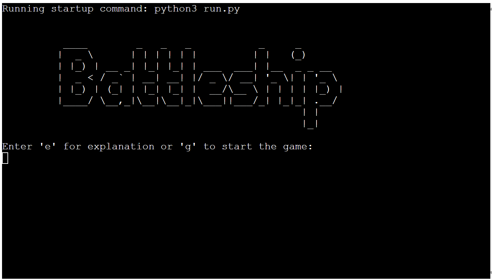
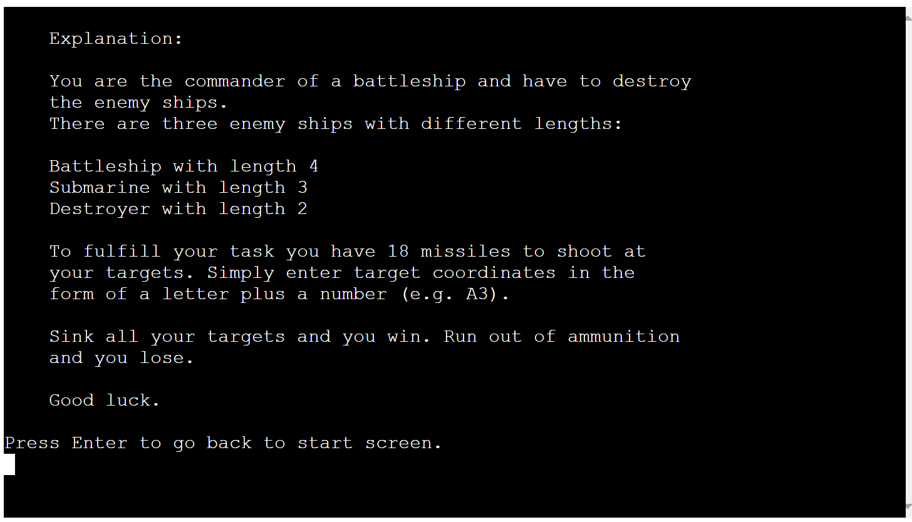
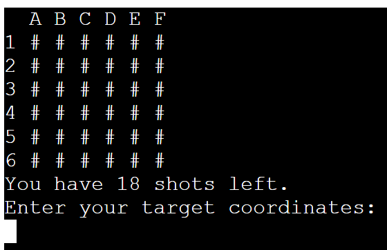
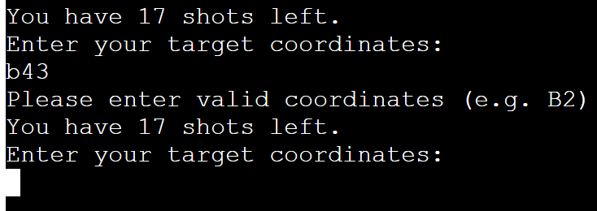
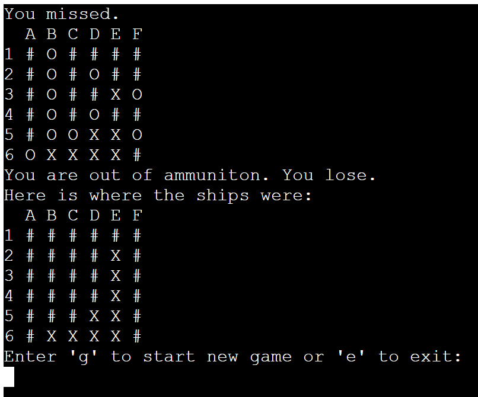
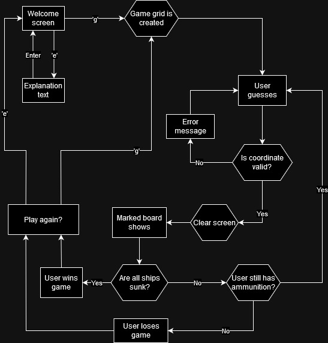

# Battleship

This program is a modified version of the classic board game battleships in which you atke the role of a battleship commander that has to attack enemy ships with limited ammunition.

The app turns battleships into a one sided game where you get all the fun of shooting at enemy ships without having to worry about your own ships.

[click here for the deployed project](https://battleship-commander-b2b519a74b77.herokuapp.com/)

## How to play

- At the start the user decides to jump right into the game or get an explanation first
- When the game starts the player sees the game grid without being able to see where the enemy ships are.
- Each turn the player shots at a chosen coordinate.
- Every shot gets marked on the game grid. Hits are marked with an 'X' and misses are marked with an 'O'.
- If the player succeeds in sinking all enemy ships within 18 turns they win. Otherwise they are out of ammunition and lose the game.

## Features 

### Welcome Screen:
- From the welcome screen the user can choose to access a short explanation text or start the game immediately.
    - The user has to enter either 'g' or 'e' otherwise an error message will show and the input is requested again.

### Explanation:
- If the user chooses to see the explanation a text is shown on screen that explains everything the user needs to know to play the game.
- At the end the user is requested to press the 'Enter' key to return to the welcome screen
    - The user has to press enter without making any other inputs or an error message will show. The user is then requested again to press the 'Enter' key

### Game:
- The Ships are placed randomly so the game is different every time.
- The game grid is shown and the player is requested to input coordinates to fire at.

- Input validation and error-checking:
    - The user cannot enter coordinates outside the game-grid
    - The user cannot enter a string longer or shorter than two characters
    - The user cannot enter an empty string
    - The user can user upper or lower case for letters

- If the player looses the game they get to see where the ships were placed.

- At the end the user can do two things:
    - start a new game by entering 'g'
    - exit and go back to the welcome screen by entering 'e'

### Future Features
- Giving the user feedback when a ship is destroyed
    - Right now the user has to waste valuable shots to confirm a ships length
- Making it impossible to target the same coordinate twice
    - Right now it is possible to hit the same target repeatedly to cheat the game an win easily
- Giving the user the possibility to choose the grid size, the amount of ships and the amount of ammunition
    - That way the user can individually set their difficulty at their discretion

## Data Model

## Testing
I performed manual testing throughout this project in the following ways:
- I passed my code through a PEP8 linter to confirm there is no problems with the code
- I have tested all inputs with strings where integers are expected, integers where strings are expected, empty strings, strings that are longer than necessary and strings that are to short
- Throughout development I tested the game in the Gitpod terminal and after deployment to Heroku in the Code Institute terminal template as well.

### Bugs
#### Bug 1:
- Issue: The game grid was empty when printed to the console.
- Solution: I forgot to use the global keyword for the battlefield and the battlefield_copy variables. So I added those to fix it.

#### Bug 2:
- Issue: In set_ship function ships could reach over the border of the game grid and cause an error.
- Solution: Added an if Statement that checks whether the boat is to Long for the grid starting at the first x/y coordinate.

#### Bug 3:
- Both the Battlefield list as well as the battlefield_copy changed when one of them was changed.
- Solution: Using the deepcopy method from the copy library to copy the battlefield list fixed the problem.

#### Validator
Using https://pep8ci.herokuapp.com/ a bunch of white space errors were found that were easy to fix by deleting the white space. Other than that no errors were found.

## Deployment
- start on https://dashboard.heroku.com/apps
- click new at top of screen and choose "create new app"
- fill in a name and choose a region
- click create app 
- go to the settings tab
- under config vars click on "reveal config vars"
- add a config var with key PORT and value 8000
- under buildpacks
- add the buildpacks python and nodejs in this order
- go to the Deploy tab
- under deployment method choose GitHub 
- confirm to connect to github
- use the searchbar that appears to search for your repository
- click connect on the right repository 
- under automatic deploys choose enable automatic deploys
- under manual deploy choose the branch from wich to deploy and click deploy branch
- click on view to get to the deployed site

## Credits
- The flowchart was made with [draw.io](https://app.diagrams.net/)
- For the welcome screen ascii art [patorjk.com](https://patorjk.com/software/taag/#p=display&f=Graffiti&t=Type%20Something%20) was used
- A tutorial on the ord() and chr() function from [digitalocean.com](https://www.digitalocean.com/community/tutorials/python-ord-chr) was used
- The unpack(*) method was found on [geeksforgeeks.org](https://www.geeksforgeeks.org/python-split-string-into-list-of-characters/)
- The hint to use the copy libraries deepcopy method was found on [stackoverflow.com](https://stackoverflow.com/questions/2612802/how-do-i-clone-a-list-so-that-it-doesnt-change-unexpectedly-after-assignment)
- The clearConsole function was taken from [delftstack.com](https://www.delftstack.com/howto/python/python-clear-console/)
- Tips on how to break up long lines of code in python were found on [pythonmorsels.com](https://www.pythonmorsels.com/breaking-long-lines-code-python/)
- [w3schools.com](https://www.w3schools.com/python/) was used to answer general questions on python functions and methods
- Special thanks to my mentor David Bowers whose tips were very helpful in development of this app